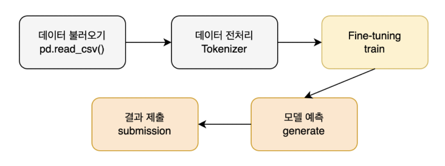

<head>
  <style>
    table.dataframe {
      white-space: normal;
      width: 100%;
      height: 240px;
      display: block;
      overflow: auto;
      font-family: Arial, sans-serif;
      font-size: 0.9rem;
      line-height: 20px;
      text-align: center;
      border: 0px !important;
    }

    table.dataframe th {
      text-align: center;
      font-weight: bold;
      padding: 8px;
    }

    table.dataframe td {
      text-align: center;
      padding: 8px;
    }

    table.dataframe tr:hover {
      background: #b8d1f3; 
    }

    .output_prompt {
      overflow: auto;
      font-size: 0.9rem;
      line-height: 1.45;
      border-radius: 0.3rem;
      -webkit-overflow-scrolling: touch;
      padding: 0.8rem;
      margin-top: 0;
      margin-bottom: 15px;
      font: 1rem Consolas, "Liberation Mono", Menlo, Courier, monospace;
      color: $code-text-color;
      border: solid 1px $border-color;
      border-radius: 0.3rem;
      word-break: normal;
      white-space: pre;
    }

  .dataframe tbody tr th:only-of-type {
      vertical-align: middle;
  }

  .dataframe tbody tr th {
      vertical-align: top;
  }

  .dataframe thead th {
      text-align: center !important;
      padding: 8px;
  }

  .page__content p {
      margin: 0 0 0px !important;
  }

  .page__content p > strong {
    font-size: 1rem !important;
  }

  </style>
</head>


## Dacon Summary


본 대회의 과제는 도배 하자와 관련된 깊이 있는 질의응답 처리 능력을 갖춘 AI 모델을 개발하는 것입니다.   

베이스라인에서는 제공된 학습 데이터셋으로부터 질문-답변 쌍을 재구성한 후,    

전처리하여 KoGPT2 모델을 Fine-tuning하여 AI 모델을 학습하고 평가 데이터셋으로부터 추론하는 과정을 담고 있습니다.   


### Baseline Modeling Process


본 베이스라인에서는 다음과 같은 프로세스를 따릅니다.




## Import


```python
import pandas as pd
import numpy as np
import torch
from transformers import GPT2LMHeadModel, PreTrainedTokenizerFast, AdamW
from tqdm import tqdm
```

<pre>
/Users/ghingtae/anaconda3/lib/python3.11/site-packages/transformers/utils/generic.py:260: UserWarning: torch.utils._pytree._register_pytree_node is deprecated. Please use torch.utils._pytree.register_pytree_node instead.
  torch.utils._pytree._register_pytree_node(
</pre>

```python
# CUDA 사용 가능 여부 확인
device = torch.device("cuda" if torch.cuda.is_available() else "cpu")
print(f"Using device: {device}")
```

<pre>
Using device: cpu
</pre>
## Data Preprocessing


```python
# 데이터 로드
data = pd.read_csv('./data/train.csv')

# 토크나이저 로드
tokenizer = PreTrainedTokenizerFast.from_pretrained('skt/kogpt2-base-v2', eos_token='</s>')

# 데이터 포맷팅 및 토크나이징
formatted_data = []
for _, row in tqdm(data.iterrows()):
    for q_col in ['질문_1', '질문_2']:
        for a_col in ['답변_1', '답변_2', '답변_3', '답변_4', '답변_5']:
            # 질문과 답변 쌍을 </s> token으로 연결
            input_text = row[q_col] + tokenizer.eos_token + row[a_col]
            input_ids = tokenizer.encode(input_text, return_tensors='pt')
            formatted_data.append(input_ids)
print('Done.')
```

<pre>
The tokenizer class you load from this checkpoint is not the same type as the class this function is called from. It may result in unexpected tokenization. 
The tokenizer class you load from this checkpoint is 'GPT2Tokenizer'. 
The class this function is called from is 'PreTrainedTokenizerFast'.
644it [00:00, 855.53it/s]
</pre>
<pre>
Done.
</pre>
<pre>

</pre>
* `PreTrainedTokenizerFast`를 활용하여 텍스트 데이터의 수치화를 진행합니다.

    > 딥러닝 모델은 수치만을 입력으로 받을 수 있지만, 제공된 데이터는 자연어(텍스트)로 구성되어 있기 때문입니다.   
    > 토크나이저는 이런 자연어를 모델이 이해할 수  있도록 수치화 하는 기능을 수행합니다.


* `.from_pretrained`를 통해 해당 모델의 토크나이저를 호출합니다.

    > KoGPT2 모델을 활용할 예정입니다.


* `eos_token`를 설정합니다.

    > 질문과 답변의 구분을 할 수 있는 것을 설정합니다.   
    > end od sentence를 뜻합니다.


* `.encode`를 통해 데이터 수치화 진행합니다.

    > 텍스트 데이터의 수치화를 진행합니다.


* `formatted_data`

    > 토크나이저를 통해 질문-답변 쌍을 수치화 후 저장합니다.


## Model Fine-tuning


KoGPT2 모델은 한국어 이해 능력과 표현 능력을 갖추고 있지만, 도배 하자 도메인에 대한 지식은 부족합니다.   

따라서, 이미 학습된 모델에게 도배 하자 데이터를 추가로 학습시킬 필요가 있습니다.   

이런 절차를 `Fine-tuning`이라고 부릅니다.   

   

본 베이스라인에서 사용하는 모델은 KoGPT2입니다. 해당 모델에 대한 설명은 다음과 같습니다


> ### KoGPT2
> GPT2는 Transformer 구조의 Decoder 부분을 활용하여 구성된 모델입니다.   
> 이런 GPT2는 주어진 텍스트의 다음 단어를 잘 예측하고, 텍스트를 생성하는 것에 특화되어 있습니다.   
> KoGPT2는 이런 GPT2 모델의 특성을 살리면서, 부족한 한국어 성능을 극복하기 위해 대량의 한글 텍스트로 학습된 언어모델입니다.   
>    
> 본 베이스라인에서는 KoGPT2 모델을 질문-답변 쌍으로 학습시켜,   
> 모델이 질문을 받을 경우 이에 대해서 다음에 나올 텍스트인 답변을 출력하게 하는 형식으로 질의응답이 가능하게 설계했습니다.


```python
# 모델 로드
model = GPT2LMHeadModel.from_pretrained('skt/kogpt2-base-v2')
model.to(device) # 모델을 CPU단으로 이동

# 모델 학습 하이퍼파라미터(Hyperparameter) 세팅
# 실제 필요에 따라 조정하세요.
CFG = {
    'LR' : 2e-5, # Learning Rate (5e-5, 4e-5, 3e-5, 2e-5, 1e-5)
    'EPOCHS' : 10, # 학습 Epoch
}

# 모델 학습 설정
optimizer = AdamW(model.parameters(), lr=CFG['LR'])
model.train()

# 모델 학습
for epoch in range(CFG['EPOCHS']):
    total_loss = 0
    progress_bar = tqdm(enumerate(formatted_data), total=len(formatted_data))
    for batch_idx, batch in progress_bar:
        # 데이터를 CPU단으로 이동
        batch = batch.to(device)
        outputs = model(batch, labels=batch)
        loss = outputs.loss
        loss.backward()
        optimizer.step()
        optimizer.zero_grad()

        total_loss += loss.item()

        # 진행률 표시줄에 평균 손실 업데이트
        progress_bar.set_description(f"Epoch {epoch+1} - Avg Loss: {total_loss / (batch_idx+1):.4f}")

    # 에폭의 평균 손실을 출력
    print(f"Epoch {epoch+1}/{CFG['EPOCHS']}, Average Loss: {total_loss / len(formatted_data)}")

# 모델 저장
model.save_pretrained("./model/cpu/hansoldeco-kogpt2")
tokenizer.save_pretrained("./model/cpu/hansoldeco-kogpt2")
```

<pre>
/Users/ghingtae/anaconda3/lib/python3.11/site-packages/transformers/optimization.py:411: FutureWarning: This implementation of AdamW is deprecated and will be removed in a future version. Use the PyTorch implementation torch.optim.AdamW instead, or set `no_deprecation_warning=True` to disable this warning
  warnings.warn(
Epoch 1 - Avg Loss: 2.8435: 100%|██████████| 6440/6440 [30:58<00:00,  3.47it/s]
</pre>
<pre>
Epoch 1/10, Average Loss: 2.843499136887352
</pre>
<pre>
Epoch 2 - Avg Loss: 1.7486: 100%|██████████| 6440/6440 [31:10<00:00,  3.44it/s]
</pre>
<pre>
Epoch 2/10, Average Loss: 1.7486186316942576
</pre>
<pre>
Epoch 3 - Avg Loss: 1.1252: 100%|██████████| 6440/6440 [31:41<00:00,  3.39it/s]
</pre>
<pre>
Epoch 3/10, Average Loss: 1.1252167138889988
</pre>
<pre>
Epoch 4 - Avg Loss: 0.7630: 100%|██████████| 6440/6440 [31:12<00:00,  3.44it/s]
</pre>
<pre>
Epoch 4/10, Average Loss: 0.7629801028853526
</pre>
<pre>
Epoch 5 - Avg Loss: 0.5382: 100%|██████████| 6440/6440 [31:43<00:00,  3.38it/s]
</pre>
<pre>
Epoch 5/10, Average Loss: 0.5382439056365108
</pre>
<pre>
Epoch 6 - Avg Loss: 0.4010: 100%|██████████| 6440/6440 [31:32<00:00,  3.40it/s]
</pre>
<pre>
Epoch 6/10, Average Loss: 0.40098250961185705
</pre>
<pre>
Epoch 7 - Avg Loss: 0.3160: 100%|██████████| 6440/6440 [31:03<00:00,  3.45it/s]
</pre>
<pre>
Epoch 7/10, Average Loss: 0.3160299617010429
</pre>
<pre>
Epoch 8 - Avg Loss: 0.2649: 100%|██████████| 6440/6440 [31:27<00:00,  3.41it/s]
</pre>
<pre>
Epoch 8/10, Average Loss: 0.26486877329497144
</pre>
<pre>
Epoch 9 - Avg Loss: 0.2293: 100%|██████████| 6440/6440 [31:24<00:00,  3.42it/s]
</pre>
<pre>
Epoch 9/10, Average Loss: 0.2292707207676324
</pre>
<pre>
Epoch 10 - Avg Loss: 0.2054: 100%|██████████| 6440/6440 [31:47<00:00,  3.38it/s]
</pre>
<pre>
Epoch 10/10, Average Loss: 0.20538172502568142
</pre>
<pre>
('./model/cpu/hansoldeco-kogpt2/tokenizer_config.json',
 './model/cpu/hansoldeco-kogpt2/special_tokens_map.json',
 './model/cpu/hansoldeco-kogpt2/tokenizer.json')
</pre>
* `GPT2LMHeadModel.from_pretrained('skt/kogpt2-base-v2')`

    > 사전 학습된 KoGPT2 모델을 불러옵니다.


* `Hyperparameter`값을 설정합니다.

    > LR(Learning Rate): 학습 속도를 결정합니다.   
    > EPOCHS: 학습을 몇 번 반복할지 결정합니다.


* `optimizer`

    > 모델 최적화 알고리즙을 설정합니다.   
    > 본 베이스라인에서는 **AdamW**로 설정했습니다.   
    >   > AdamW는 과적합 방지와 일반화 성능 향상에 우수합니다.


* `save_pretrained`

    > Fine-tuning이 완료된 모델의 weight를 저장합니다.   
    > 모델과 토크나이저를 저장할 수 있습니다.


## Model Inference


```python
# 저장된 Fine-tuned 모델과 토크나이저 불러오기
model_dir = "./model/cpu/hansoldeco-kogpt2"
model = GPT2LMHeadModel.from_pretrained(model_dir)
model.to(device)
tokenizer = PreTrainedTokenizerFast.from_pretrained(model_dir)

# Inference를 위한 test.csv 파일 로드
test = pd.read_csv('./data/test.csv')

# test.csv의 '질문'에 대한 '답변'을 저장할 리스트
preds = []

# '질문' 컬럼의 각 질문에 대해 답변 생성
for test_question in tqdm(test['질문']):
    # 입력 텍스트를 토큰화하고 모델 입력 형태로 변환
    input_ids = tokenizer.encode(test_question + tokenizer.eos_token, return_tensors='pt')

    # 답변 생성
    output_sequences = model.generate(
        input_ids=input_ids.to(device),
        max_length=300,
        temperature=0.9,
        top_k=1,
        top_p=0.9,
        repetition_penalty=1.2,
        do_sample=True,
        num_return_sequences=1
    )

    # 생성된 텍스트(답변) 저장
    for generated_sequence in output_sequences:
        full_text = tokenizer.decode(generated_sequence, skip_special_tokens=False)
        # 질문과 답변의 사이를 나타내는 eos_token (</s>)를 찾아, 이후부터 출력
        answer_start = full_text.find(tokenizer.eos_token) + len(tokenizer.eos_token)
        answer_only = full_text[answer_start:].strip()
        answer_only = answer_only.replace('\n', ' ')
        preds.append(answer_only)
```

<pre>
100%|██████████| 130/130 [06:03<00:00,  2.79s/it]
</pre>
* `.from_pretrained`

    > 앞서 저장한 모델과 토크나이저를 불러옵니다.


* `encode`

    > 테스트 데이터에서 제공되는 질문과 eos_token을 합쳐 input_ids를 구상하고 수치화합니다.   
    > 이것은 모델에게 질문 부분만을 입력한 것입니다.


* `generate`

    > input_ids에 대한 답변을 생성합니다.   
    >   > * max_length: 생성될 텍스트의 최대 길이입니다.   
    >   > * temperature: 생성 텍스트의 다양성을 제어하는 하이퍼 파라미터입니다.(값이 커질수록 다양한 텍스트 생성)   
    >   > * top_k: 토큰을 생성하는 각 단계에서 고려할 토큰 후보의 수입니다.(값이 커질수록 고려하는 토큰 수가 많아져 다양한 텍스트 생성)   
    >   > * top_p: 토큰을 생성하는 단계에서 누적확률합이 p값 이하인 토큰들을 후보로 삼는 방식입니다.(값이 커질수록 고려하는 토큰 수가 많아져 다양한 텍스트 생성)   
    >   > * repetition_penalty: 반복되는 단어나 구절에 대해서 부과되는 패널티입니다.(해당 값이 1보다 클 경우 모델이 반복을 피하도록 유도)   
    >   > * do_sample=True: 토큰을 생성하는 단계에서 확률적 샘플링을 수행합니다.   
    >   > * num_return_sequences: 생성할 시퀀스의 수입니다.


* `decode`

    > 사람이 인식하는 텍스트로 변환합니다.   
    > `skip_special_token=False`는 eos_token이 출력에서 유지되도록 합니다.   
    >   > 해당 과정을 통해 모델이 생성한 텍스트 중 답변 부분만을 구분 가능합니다.


## Submission


```python
# Test 데이터셋의 모든 질의에 대한 답변으로부터 512 차원의 Embedding Vector 추출
# 평가를 위한 Embedding Vector 추출에 활용하는 모델은 'distiluse-base-multilingual-cased-v1' 이므로 반드시 확인해주세요.
from sentence_transformers import SentenceTransformer # SentenceTransformer Version 2.2.2

# Embedding Vector 추출에 활용할 모델(distiluse-base-multilingual-cased-v1) 불러오기
model = SentenceTransformer('distiluse-base-multilingual-cased-v1')

# 생성한 모든 응답(답변)으로부터 Embedding Vector 추출
pred_embeddings = model.encode(preds)
pred_embeddings.shape
```

<pre>
Downloading modules.json:   0%|          | 0.00/341 [00:00<?, ?B/s]
</pre>
<pre>
Downloading (…)ce_transformers.json:   0%|          | 0.00/122 [00:00<?, ?B/s]
</pre>
<pre>
Downloading README.md:   0%|          | 0.00/2.45k [00:00<?, ?B/s]
</pre>
<pre>
Downloading (…)nce_bert_config.json:   0%|          | 0.00/53.0 [00:00<?, ?B/s]
</pre>
<pre>
Downloading config.json:   0%|          | 0.00/556 [00:00<?, ?B/s]
</pre>
<pre>
Downloading pytorch_model.bin:   0%|          | 0.00/539M [00:00<?, ?B/s]
</pre>
<pre>
Downloading tokenizer_config.json:   0%|          | 0.00/452 [00:00<?, ?B/s]
</pre>
<pre>
Downloading vocab.txt:   0%|          | 0.00/996k [00:00<?, ?B/s]
</pre>
<pre>
Downloading tokenizer.json:   0%|          | 0.00/1.96M [00:00<?, ?B/s]
</pre>
<pre>
Downloading (…)cial_tokens_map.json:   0%|          | 0.00/112 [00:00<?, ?B/s]
</pre>
<pre>
Downloading 1_Pooling/config.json:   0%|          | 0.00/190 [00:00<?, ?B/s]
</pre>
<pre>
Downloading 2_Dense/config.json:   0%|          | 0.00/114 [00:00<?, ?B/s]
</pre>
<pre>
Downloading pytorch_model.bin:   0%|          | 0.00/1.58M [00:00<?, ?B/s]
</pre>
<pre>
(130, 512)
</pre>
Submission은 Dacon 참가자분들의 답변이 Dacon의 리더보드 시스템에 맞도록 제출물을 변환하는 과정입니다.   

본 대회에서는 답변과 정답을 `distiluse-base-multilingual-cased-v1`모델을 활용하여 512 차원의 임베딩 벡터로 수치화합니다.   


```python
submit = pd.read_csv('./data/sample_submission.csv')
# 제출 양식 파일(sample_submission.csv)을 활용하여 Embedding Vector로 변환한 결과를 삽입
submit.iloc[:,1:] = pred_embeddings
submit.head()
```

<div>
<style scoped>
    .dataframe tbody tr th:only-of-type {
        vertical-align: middle;
    }

    .dataframe tbody tr th {
        vertical-align: top;
    }

    .dataframe thead th {
        text-align: right;
    }
</style>
<table border="1" class="dataframe">
  <thead>
    <tr style="text-align: right;">
      <th></th>
      <th>id</th>
      <th>vec_0</th>
      <th>vec_1</th>
      <th>vec_2</th>
      <th>vec_3</th>
      <th>vec_4</th>
      <th>vec_5</th>
      <th>vec_6</th>
      <th>vec_7</th>
      <th>vec_8</th>
      <th>...</th>
      <th>vec_502</th>
      <th>vec_503</th>
      <th>vec_504</th>
      <th>vec_505</th>
      <th>vec_506</th>
      <th>vec_507</th>
      <th>vec_508</th>
      <th>vec_509</th>
      <th>vec_510</th>
      <th>vec_511</th>
    </tr>
  </thead>
  <tbody>
    <tr>
      <th>0</th>
      <td>TEST_000</td>
      <td>0.027340</td>
      <td>0.061596</td>
      <td>-0.025882</td>
      <td>-0.007046</td>
      <td>0.106774</td>
      <td>-0.004059</td>
      <td>-0.000069</td>
      <td>0.036387</td>
      <td>0.037929</td>
      <td>...</td>
      <td>-0.000998</td>
      <td>-0.057284</td>
      <td>0.019608</td>
      <td>-0.036453</td>
      <td>-0.005372</td>
      <td>0.046832</td>
      <td>0.014650</td>
      <td>-0.035521</td>
      <td>-0.015767</td>
      <td>0.049623</td>
    </tr>
    <tr>
      <th>1</th>
      <td>TEST_001</td>
      <td>-0.020574</td>
      <td>0.020437</td>
      <td>0.014370</td>
      <td>0.004303</td>
      <td>0.130412</td>
      <td>-0.003798</td>
      <td>0.012226</td>
      <td>-0.010731</td>
      <td>0.018440</td>
      <td>...</td>
      <td>-0.047342</td>
      <td>-0.003164</td>
      <td>0.005325</td>
      <td>-0.042955</td>
      <td>-0.024845</td>
      <td>0.034305</td>
      <td>-0.008815</td>
      <td>-0.033210</td>
      <td>0.018155</td>
      <td>0.070663</td>
    </tr>
    <tr>
      <th>2</th>
      <td>TEST_002</td>
      <td>-0.007324</td>
      <td>0.005959</td>
      <td>-0.049301</td>
      <td>-0.009871</td>
      <td>0.122781</td>
      <td>-0.013124</td>
      <td>0.021922</td>
      <td>0.019223</td>
      <td>0.068486</td>
      <td>...</td>
      <td>-0.007393</td>
      <td>-0.009298</td>
      <td>0.046817</td>
      <td>0.003442</td>
      <td>-0.022947</td>
      <td>0.007397</td>
      <td>0.042711</td>
      <td>-0.032420</td>
      <td>-0.045406</td>
      <td>0.045719</td>
    </tr>
    <tr>
      <th>3</th>
      <td>TEST_003</td>
      <td>-0.008537</td>
      <td>0.017302</td>
      <td>-0.014496</td>
      <td>0.023185</td>
      <td>0.077229</td>
      <td>-0.031583</td>
      <td>-0.068986</td>
      <td>0.037647</td>
      <td>0.020204</td>
      <td>...</td>
      <td>-0.028376</td>
      <td>-0.007717</td>
      <td>0.068868</td>
      <td>-0.042251</td>
      <td>0.031930</td>
      <td>0.052879</td>
      <td>-0.001870</td>
      <td>-0.004468</td>
      <td>-0.038466</td>
      <td>0.049311</td>
    </tr>
    <tr>
      <th>4</th>
      <td>TEST_004</td>
      <td>-0.028175</td>
      <td>-0.029158</td>
      <td>0.008954</td>
      <td>0.002002</td>
      <td>0.122598</td>
      <td>-0.022691</td>
      <td>0.016108</td>
      <td>0.072007</td>
      <td>-0.008675</td>
      <td>...</td>
      <td>0.020321</td>
      <td>-0.010479</td>
      <td>0.060179</td>
      <td>-0.023746</td>
      <td>-0.028497</td>
      <td>0.009646</td>
      <td>0.031331</td>
      <td>-0.015341</td>
      <td>0.006441</td>
      <td>0.090920</td>
    </tr>
  </tbody>
</table>
<p>5 rows × 513 columns</p>
</div>


```python
# 리더보드 제출을 위한 csv파일 생성
submit.to_csv('./result/cpu_submit_epochs_10_lr_2e-5.csv', index=False)
```

## References


* [Dacon](https://dacon.io/edu/127/1)(도배 하자 AI 모델 개발)

